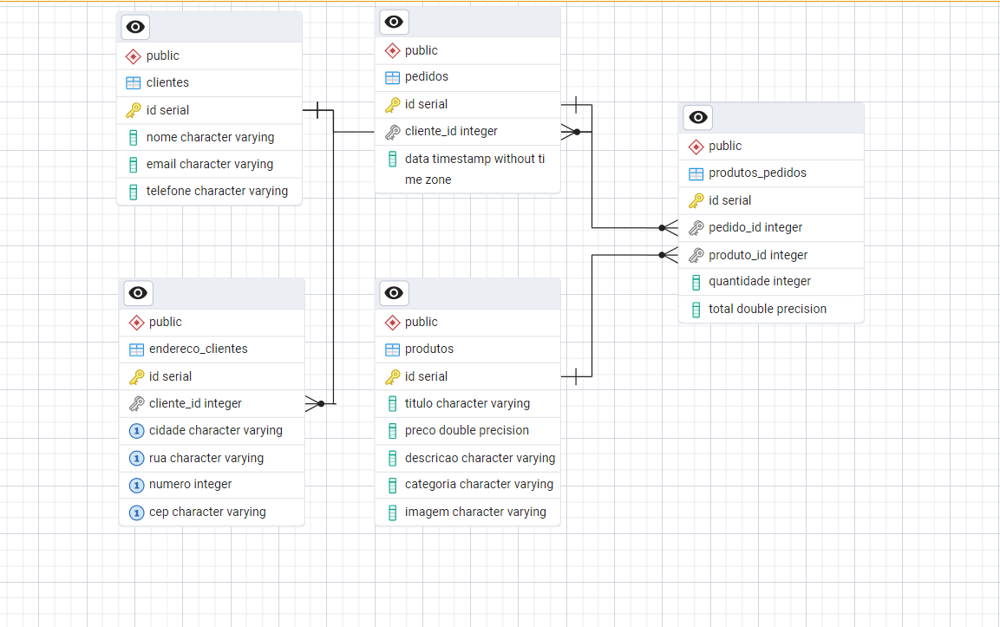

# Projeto de ETL para E-commerce: Extração de Dados da Fake Store API

Projeto de pipeline de ETL que extrai dados da API de um e-commerce (Fake Store), realiza a transformação e os armazena em um Data Warehouse local (PostgreSQL), com orquestração via Apache Airflow.

## Introdução

### Oque é um E-commerce?
Um e-commerce (ou comércio eletrônico) é uma forma de comércio que acontece de maneira digital, ou seja, a compra e venda de produtos e serviços são realizadas através da internet. Isso pode envolver desde lojas virtuais e marketplaces até transações diretas entre empresas (B2B) ou entre empresas e consumidores (B2C).


### Panorama do E-commerce no Brasil
O e-commerce brasileiro segue uma trajetória de crescimento contínuo, com um faturamento aproximado de R$ 200 bilhões em 2024, consolidando o Brasil como o maior mercado de e-commerce da América Latina. A digitalização acelerada dos consumidores e a expansão do mobile commerce impulsionam o setor, que já representa cerca de 13% a 15% das vendas do varejo nacional.

Os principais segmentos incluem moda, eletrônicos e alimentos, enquanto os marketplaces dominam o cenário, com empresas como Mercado Livre, Shopee e Amazon se destacando. Além disso, tendências como pagamentos digitais, inteligência artificial, e omnichannel ganham força, moldando a experiência do consumidor.

Apesar do crescimento, o setor enfrenta desafios em áreas como logística, fraudes e regulamentações, exigindo inovação e adaptação constante das empresas. Em um cenário competitivo, os players que investem em tecnologia e personalização se destacam e conquistam a preferência do consumidor.

## Por que esse projeto foi desenvolvido?
Este projeto foi desenvolvido para atender à crescente demanda por soluções automatizadas e escaláveis no e-commerce, com foco na otimização da análise de dados. Ao integrar a Fake Store API com um Data Warehouse em PostgreSQL, o objetivo é garantir a atualização contínua e a integridade dos dados de pedidos, produtos e usuários. A solução permite a carga e transformação eficientes de dados, proporcionando informações valiosas para tomada de decisões estratégicas, como o monitoramento de desempenho e comportamento do consumidor.

A partir da implementação de uma pipeline de ETL automatizada, orquestrada pelo Apache Airflow, o projeto busca melhorar a eficiência operacional, reduzir custos e aumentar a agilidade na análise de dados, fundamentais para empresas no mercado de e-commerce que buscam um processo decisional ágil e preciso.

## Ferramentas escolhidas

1- Python: Utilizado por sua flexibilidade, vasto ecossistema de bibliotecas e facilidade em manipulação de dados. É ideal para a construção de pipelines ETL e integração com APIs, além de ser amplamente adotado na engenharia de dados.

2- SQLAlchemy: Biblioteca que facilita a interação entre Python e bancos de dados relacionais. Foi escolhida para abstrair a complexidade da comunicação com o PostgreSQL e para realizar a transformação dos dados de forma eficiente antes de inseri-los no banco.

3- requests: Biblioteca utilizada para fazer requisições HTTP à Fake Store API e extrair os dados necessários. Foi escolhida por sua simplicidade e eficiência no manejo de APIs RESTful, permitindo facilmente acessar e consumir os dados da API para transformá-los e armazená-los no banco de dados.

4- PostgreSQL: Sistema de gerenciamento de banco de dados relacional robusto e confiável, adequado para armazenar grandes volumes de dados de forma estruturada. Sua escolha se deve à sua capacidade de lidar com dados transacionais e pela compatibilidade com SQLAlchemy.

5- Apache Airflow: Framework de orquestração de workflows escolhido por sua capacidade de agendar, monitorar e gerenciar a execução das etapas do ETL. O Airflow oferece flexibilidade para criar pipelines complexas e escaláveis, com monitoramento fácil e integração com outras ferramentas.

6- Docker: Usado para criar containers isolados, garantindo que todas as ferramentas, incluindo o PostgreSQL e o Airflow, possam ser executadas de maneira consistente em diferentes ambientes. Facilita a replicação do ambiente de desenvolvimento e produção.

7- Astronomer: Plataforma para gerenciar e orquestrar pipelines com Apache Airflow. Sua escolha se deu pela facilidade em implementar e monitorar DAGs, além da compatibilidade com o Docker, o que facilita a integração com o projeto.


## Etapas do projeto

### 1 - Configuração do ambiente

Instalação do astromer airflow [Astronomer install](https://www.astronomer.io/docs/astro/cli/install-cli)

### 2 - Exploração da API da Fake Store

Através da documentação da API([Documentação](https://fakestoreapi.com/docs)) e da biblioteca request, conheci quais dados ela me fornecia e com quais seriam utéis.

### 3 - Criação dos scripts de ETL e modelagem do banco de dados

1- Extração -> Na primeira etapa do pipeline, realizamos a extração dos dados da Fake Store API utilizando a biblioteca requests. O objetivo foi buscar as informações necessárias sobre produtos, usuários e pedidos. A extração é feita via requisições HTTP GET, onde o retorno é um JSON contendo os dados. A partir disso, filtramos e extraímos as informações relevantes para as etapas seguintes.[código completo da extração](./include/extract.py)

2- Transformação -> Com os dados extraídos, foi necessário realizar uma série de transformações para preparar os dados para o carregamento no banco de dados. As transformações envolveram a seleção de campos relevantes. Após as transformações, os dados foram armazenados em uma lista de dicionários, uma estrutura de dados que facilita a manipulação e o mapeamento dos dados para o formato esperado pelas tabelas do banco de dados.[Código completo da transformação](./include/transform.py)

3- Conexao com o PostgreSQL -> Após transformar os dados, a próxima etapa foi a criação da conexão com o PostgreSQL. Para facilitar a interação com o banco de dados, utilizamos a biblioteca SQLAlchemy, que fornece uma interface de ORM (Object-Relational Mapping) para trabalhar com bancos de dados relacionais de forma eficiente. O código de conexão permite estabelecer a comunicação entre o código Python e o banco de dados PostgreSQL, tornando possível a inserção dos dados transformados.[Código de conexão com o banco](./include/db.py)

4- Modelagem do banco de dados -> Com a conexão estabelecida, a modelagem do banco de dados foi a próxima etapa. Utilizamos o SQLAlchemy ORM para definir as tabelas e seus relacionamentos. Cada classe no código representa uma tabela no banco de dados, e cada atributo da classe representa uma coluna da tabela, com seu tipo de dado (por exemplo, String, Integer, Float ou ForeignKey). Para modelar o relacionamento entre as tabelas, usamos o relationship, o que permite associar as tabelas de forma bidirecional, facilitando consultas complexas entre elas.
[Código completo da modelagem](./include/models.py)


5 - Carregamento -> Após concluir a extração, transformação e modelagem, chegou a etapa de carregar os dados no banco de dados. Para isso, utilizamos o SQLAlchemy para inserir os dados nas tabelas do PostgreSQL. O processo envolve a inserção de dados linha por linha nas tabelas, utilizando sessões de transação do SQLAlchemy, garantindo a integridade dos dados e evitando problemas como duplicação ou falhas durante o processo de carga.[Código de carregamento](./include/load.py)

### 4 - Criação das tasks e da dag no Airflow

Com todas as etapas do pipeline de ETL funcionando corretamente, era necessário orquestrar o processo de forma automática e escalável. Para isso, utilizamos o Apache Airflow com Astronomer, uma plataforma que facilita o gerenciamento e execução de workflows.

#### 1 - Criação das Tasks
Primeiramente, criamos as tasks para cada etapa do pipeline de ETL:

- Extração(t1,t2,t3): tarefa responsável por chamar a API e extrair os dados.
- Transformação(t4,t5,t6,t7,t8): tarefa responsável por processar e formatar os dados extraídos.
- Carregamento(t9): tarefa responsável por inserir os dados transformados no banco de dados PostgreSQL.

#### 2 - Criação da DAG
Após definir as tasks, criamos a DAG (Directed Acyclic Graph), que é a estrutura que define a ordem e a lógica de execução das tasks. A DAG foi configurada para rodar diariamente, garantindo que o pipeline de ETL seja executado automaticamente a cada dia, verificando novos dados, realizando a extração, transformação e carga. A DAG também garante que as tasks sejam executadas na ordem correta, respeitando as dependências entre elas.

A orquestração com o Airflow permite que o processo seja escalável e fácil de monitorar, oferecendo visibilidade e controle sobre a execução do pipeline. O Airflow também oferece recursos para lidar com falhas e reiniciar as tarefas automaticamente, caso necessário. [dag airflow](./dags/etl_pipeline.py)

## Como Executar o Projeto

Antes de executar o projeto, você precisa ter o Docker Compose instalado([Como instalar Docker Compose](https://docs.docker.com/compose/install/)) e o Astronomer CLI(airflow)([Como instalar o Astronomer CLI](https://www.astronomer.io/docs/astro/cli/install-cli)).

### 1- Clonar o repositório
Clone o repositório para sua máquina local:

bash
git clone https://github.com/joaopoliveirac/ETL_E-COMMERCE.git


### 2- Acessar o repositório do projeto
Após clonar o repositório, entre no diretório do projeto:

bash
cd ETL_E-COMMERCE


### 3- Iniciar o Astronomer CLI
Estando na pasta do projeto, rodar o seguinte comando para iniciar:

bash
astro dev start

Isso irá subir os containers do projeto no seu Docker e permitir o acesso ao [Airflow](localhost:8080) para acompanhar a execução da pipeline.

## Como Executar o Projeto

Antes de executar o projeto, você precisa ter o Docker Compose instalado[Como instalar Docker Compose](https://docs.docker.com/compose/install/) e o Astronomer CLI(airflow)[Como instalar o Astronomer CLI](https://www.astronomer.io/docs/astro/cli/install-cli).

### 1- Clonar o repositório
Clone o repositório para sua máquina local:

bash
git clone https://github.com/joaopoliveirac/ETL_E-COMMERCE.git


### 2- Acessar o repositório do projeto
Após clonar o repositório, entre no diretório do projeto:

bash
cd ETL_E-COMMERCE

### 3- Iniciar o banco Postgre

Agora, use o Docker Compose para construir e rodar o container do postgre.

```bash
docker-compose up -d --build
```

Isso irá iniciar o Postgre no Docker.

### 4- Iniciar o Astronomer CLI
Estando na pasta do projeto, rodar o seguinte comando para iniciar:

bash
astro dev start

Isso irá subir o container do projeto no seu Docker e permitir o acesso ao [Airflow](localhost:8080) para acompanhar a execução da pipeline.


